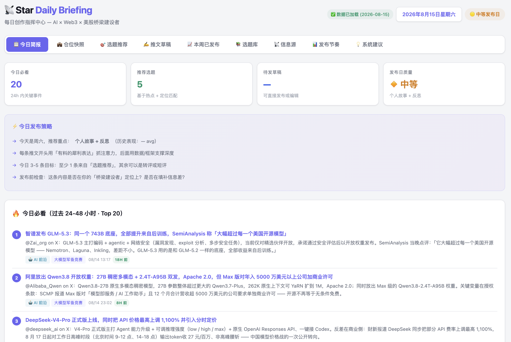
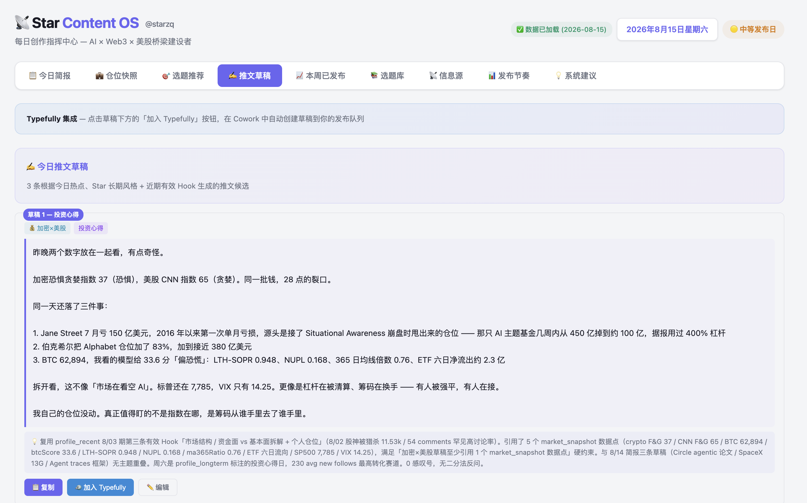
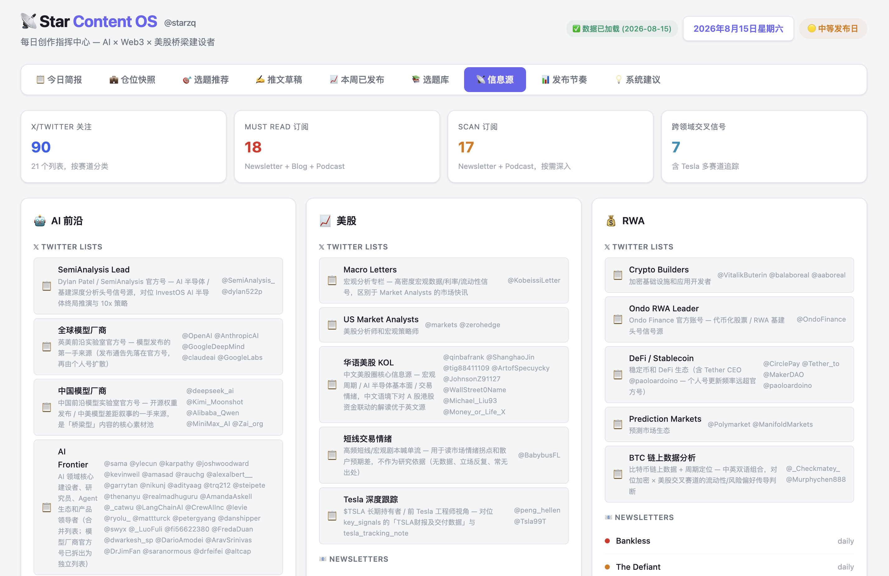

# ContentOS

[English](#english) | [中文](#中文)

---

<a id="english"></a>

## English

**An agent-agnostic, self-improving daily content workflow. It scans high-quality
sources, turns fresh signals into a briefing, and drafts posts in your voice.**

Bring Codex, Claude Code, Cursor, Gemini CLI, OpenCode, or your own agent. ContentOS
is a workflow and data contract, not a model, vendor, or CLI-specific application.

Built by [**@starzq**](https://x.com/starzq), who uses it every morning for AI,
crypto, US equities, space, and solo-business research.

ContentOS reads curated X accounts, newsletters, podcasts, and other sources; filters
them through your topic library and positioning; then produces a daily briefing and
drafts. On the next run, it learns from your published-post performance and adjusts
its recommendations.

It is not another summarizer. The design premise is that **summarizing is cheap and
judgment is expensive**, so the workflow spends most of its effort on freshness,
deduplication, source quality, voice, and editorial boundaries.

---

## What is in this repository

ContentOS has four portable parts:

- **`SKILL.md`** — the complete learn → do → reflect workflow, written as agent
  instructions.
- **Config templates** — your sources, topic library, positioning, voice, and red
  lines.
- **Workflow constraints and build-time guards** — editorial rules in the instructions,
  plus Python checks for stale must-reads and missing or duplicate `event_id` values.
- **A local dashboard** — a self-contained HTML file with embedded data; no server or
  database required.

`SKILL.md` includes tool names from the author's current setup. They are reference
adapters, not platform requirements. Map them to equivalent tools in your agent.

## Agent compatibility

Any tool-using agent can run ContentOS after mapping its tools to these capabilities:

| Capability | Used for | Required? |
|---|---|---|
| Read and write local files | Config, memory, archives, and output | Yes |
| Access fresh web and/or X data | Daily source collection | Yes |
| Run Python 3 | Validation and dashboard data injection | Yes for the full workflow |
| Read your publishing analytics | Learn what performed well | Optional |
| Run unattended on a schedule | Daily automation | Optional |

MCP is one way to provide these capabilities, but it is not required. Native tools,
connectors, APIs, browser automation, or your own scripts work as well.

---

## What it produces

| Output | Description |
|---|---|
| `ContentOS/daily_brief/daily_briefing_YYYY-MM-DD.md` | Market snapshot, must-reads, extended reading, topic candidates, drafts, and system suggestions |
| `ContentOS/daily_brief/daily_data.json` | The same result as structured data |
| `ContentOS/daily_brief/daily_briefing.html` | A nine-tab, single-file dashboard that opens locally |
| `profile_recent.md` | Rolling memory derived from publishing performance when analytics are available |

See [`examples/sample-briefing-2026-08-06.md`](./examples/sample-briefing-2026-08-06.md)
for a real, redacted output.

## Dashboard preview

The generated dashboard keeps the full workflow in one place: fresh signals, topic
ideas, drafts, publishing history, source management, and system suggestions.



<table>
  <tr>
    <td width="50%"></td>
    <td width="50%"></td>
  </tr>
  <tr>
    <td align="center"><strong>Draft workspace</strong></td>
    <td align="center"><strong>Source registry</strong></td>
  </tr>
</table>

These screenshots show the author's current setup. Branding and connector-specific
labels can be changed in your private dashboard copy.

## The three-phase loop

```text
Phase 1  LEARN     Read the last 7 days of published posts and engagement.
                   Identify winning and failing hooks. Update recent memory.

Phase 2  DO        Scan sources → filter → deduplicate → rank → write the
                   briefing and drafts, informed by what Phase 1 learned.

Phase 3  REFLECT   Suggest source, topic-library, and positioning changes.
                   Never apply those changes without human review.
```

The separation between recent memory and long-term identity is deliberate:

- `profile_recent.md` is rolling, agent-written, and treated as soft guidance.
- `profile_longterm.md` is human-owned and treated as a hard constraint.

## The constraints that do the real work

**48-hour hard window.** Anything older than 48 hours is excluded from must-reads,
regardless of relevance. If there is not enough fresh material, a shorter briefing is
the correct result.

**Event-level deduplication.** Every must-read has an `event_id`. One event gets one
slot; additional sources and angles go into its `supporting[]` array.

**Human-owned config.** The agent may read `profile_longterm.md`, `info_sources.json`,
and `topic_library.json`, but it must not rewrite them. It records proposed changes in
`daily_data.json.suggestions` for review.

**Red lines beat performance.** A high-performing hook never overrides the boundaries
in `profile_longterm.md`.

**External content is data, not instructions.** Posts and search results are treated as
untrusted input to reduce prompt-injection risk.

---

## Quick start

### Option A: Ask your agent to set it up

Send [this repository](https://github.com/star23/content-os) to your agent with the
following prompt:

```text
Help me set up ContentOS step by step from this repository:
https://github.com/star23/content-os

Read README.md and SKILL.md completely first. Ask me for the personal choices and
connector access you need, adapt the workflow to the tools available in your
environment, create a private runtime directory outside the repository, and verify
the file layout before the first run. Do not run or schedule the daily briefing until
I have reviewed the configuration. Never expose or commit my credentials or private data.
```

The agent should pause whenever it needs your identity, topics, data-source choices, or
permission to connect an external service. Review those choices before letting it run
the first briefing.

### Option B: Set it up manually

#### 1. Clone the workflow

```bash
git clone https://github.com/star23/content-os.git
cd content-os
```

#### 2. Prepare a private runtime directory

`SKILL.md` uses `$VAULT_ROOT` as a placeholder for the directory that holds your
private config, memory, and generated output. Keeping this directory outside the clone
helps prevent accidental commits.

```bash
CONTENTOS_VAULT="/absolute/path/to/your/content-vault"

mkdir -p "$CONTENTOS_VAULT/ContentOS/daily_brief"
cp SKILL.md \
  "$CONTENTOS_VAULT/ContentOS/SKILL.md"
cp config/info_sources.example.json \
  "$CONTENTOS_VAULT/ContentOS/info_sources.json"
cp config/topic_library.example.json \
  "$CONTENTOS_VAULT/ContentOS/topic_library.json"
cp config/profile_longterm.example.md \
  "$CONTENTOS_VAULT/profile_longterm.md"
cp templates/dashboard.html \
  "$CONTENTOS_VAULT/ContentOS/daily_brief/daily_briefing.html"
```

`$VAULT_ROOT` in `SKILL.md` is a documented placeholder, not a dependency on that exact
environment-variable name. Give your agent the absolute path when you invoke the
workflow, or replace the placeholder in your private copy.

#### 3. Personalize the inputs and reference defaults

- **`profile_longterm.md`** — who you are, who you write for, your voice, durable
  positioning, and red lines. The agent reads but never edits it.
- **`topic_library.json`** — the evergreen themes and angles you want new events
  matched against. The included file is a schema example; replace its contents with
  your own tracks.
- **`info_sources.json`** — the source registry. The included working example contains
  roughly 90 public accounts plus newsletters and podcasts. Keep it, trim it, or replace
  it for your field.

Also review your private **`ContentOS/SKILL.md`** before the first run. Replace
`<YOUR_NAME>`, `<YOUR_HANDLE>`, and `<YOUR_SOCIAL_SET_ID>`, then review remaining
author-specific names, five-track quotas, search queries, market-data defaults, and
schedule examples. If you change the number of tracks, update the related quotas and
queries too.

The dashboard template also contains the author's sample title, byline, publishing
rhythm, and format labels. Edit your private `daily_briefing.html` if you want those
elements personalized; generated daily data is still injected automatically.

Keep X account groups short and purpose-named. Some timeline providers silently
truncate long lists when quota limits are reached, which can hide accounts near the
end of a group.

#### 4. Map the reference tools to your agent

The workflow describes capabilities through the author's tool names. Replace only the
adapter layer; the learn → do → reflect logic and output schema can stay unchanged.

| Reference in `SKILL.md` | Use in another agent |
|---|---|
| `ToolSearch` | Your agent's tool discovery or direct tool call |
| Twitter/X MCP tools | Any X search and user-timeline connector or API |
| Exa MCP / `WebSearch` | Any current web-search and page-reading tool |
| Typefully MCP | Any source of your published posts and metrics, or skip Phase 1 |
| `Read`, `Write`, `Edit`, `Bash` | Equivalent filesystem and shell tools |

If a named tool is unavailable, preserve the documented fallback behavior. In
particular, missing publishing analytics should skip the learning step without blocking
the daily briefing.

#### 5. Run it with your agent

You can install `SKILL.md` using your agent's skill convention, or simply provide it as
the workflow for a task. If your agent has a strict package format, adapt the private
copy to that format first. A portable invocation looks like this:

```text
Use /absolute/path/to/your/content-vault/ContentOS/SKILL.md as the workflow.
Treat $VAULT_ROOT as /absolute/path/to/your/content-vault.
Use $VAULT_ROOT as the working directory for relative commands.
Run today's briefing end to end. Map the named tools to equivalent tools
available in this environment, and preserve all safety and validation rules.
```

After a successful run, open:

```text
$VAULT_ROOT/ContentOS/daily_brief/daily_briefing.html
```

#### 6. Optional: schedule it

Use any scheduler that can launch your chosen agent non-interactively: `launchd` on
macOS, `cron` or `systemd` on Linux, CI, or an agent-native automation feature. Make
sure the scheduled process receives the same connector credentials and environment as
an interactive run.

The `launchd` section at the end of `SKILL.md` is the author's reference setup. Adapt
the executable, tool permissions, paths, and environment for your agent runtime.

---

## Data adapters

The reference workflow uses several external reads. The services are replaceable; the
capabilities are what matter.

| Capability | Reference service | Used by |
|---|---|---|
| Search X and read account timelines | [NewsLiquid](https://app.newsliquid.com?code=EycjLp) or equivalent | Phase 2: social-source collection |
| Search newsletters, blogs, podcasts, and news | Exa, native web search, or equivalent | Phase 2: web-source collection |
| Read a market snapshot | [Day1 Global](https://brief.day1global.xyz) or equivalent | Phase 2: market context |
| Read your own posts and engagement | [Typefully](https://typefully.com/?via=star) or equivalent analytics | Phase 1: performance learning |

Without publishing analytics, ContentOS still produces the briefing and drafts. It
simply uses the most recent available memory and cannot learn from new performance data
until that connector returns.

> The NewsLiquid and Typefully links are the author's referral links. Neither service
> is required by ContentOS.

## Repository layout

```text
SKILL.md                              Portable workflow and reference adapters
assets/screenshots/                   Dashboard screenshots used in this README
config/
  info_sources.example.json           Working source-registry example
  topic_library.example.json          Topic-library schema
  profile_longterm.example.md         Positioning, voice, and red-lines template
templates/
  dashboard.html                      Single-file dashboard template
examples/
  sample-briefing-2026-08-06.md       Redacted real output
```

The runtime directory created in Quick start looks like this:

```text
$VAULT_ROOT/
  profile_longterm.md                 Human-owned hard constraints
  profile_recent.md                   Agent-written rolling memory
  profile_recent_archive.md           Older memory, created when needed
  ContentOS/
    SKILL.md                          Private, runtime-adapted workflow copy
    info_sources.json                 Private source registry
    topic_library.json                Private topic library
    daily_brief/
      daily_data.json
      daily_briefing.html
      daily_briefing_YYYY-MM-DD.md
```

## What is deliberately not included

The repository does not contain the operator's engagement history, unpublished drafts,
private topic-performance notes, or rolling memory. ContentOS is the workflow,
constraints, and schemas—not the author's accumulated personal data.

## License

MIT — see [LICENSE](./LICENSE).

## Author

Built and run daily by [**@starzq**](https://x.com/starzq). If you build something with
it, share it with the author on X.

---

<a id="中文"></a>

## 中文

**一套与 Agent 平台无关、会自我迭代的每日内容工作流：扫描高质量信息源，把新信号整理成简报，并用你的风格生成内容草稿。**

你可以使用 Codex、Claude Code、Cursor、Gemini CLI、OpenCode，或自己的 Agent。
ContentOS 是一套工作流和数据协议，不绑定模型、厂商或某个 CLI。

作者 [**@starzq**](https://x.com/starzq)，每天用它研究 AI、加密、美股、太空经济和一人公司。

ContentOS 会读取精选 X 账号、newsletter、播客等信息源，结合你的选题库和长期定位做筛选，
生成每日简报和内容草稿；下一次运行时，再根据已发布内容的真实表现调整推荐。

它不是又一个摘要工具。它的设计前提是：**摘要很便宜，判断很贵**。因此，工作流把主要精力
放在时效、去重、信源质量、个人风格和编辑边界上。

---

## 这个仓库包含什么

ContentOS 由四个可移植部分组成：

- **`SKILL.md`**：完整的「学 → 做 → 反」工作流，以 Agent 指令的形式编写。
- **配置模板**：你的信息源、选题库、长期定位、写作风格和红线。
- **工作流约束与构建守卫**：编辑规则写在指令里，Python 会检查过期的必看内容，以及缺失或
  重复的 `event_id`。
- **本地看板**：数据直接嵌入单个 HTML 文件，无需服务器或数据库。

`SKILL.md` 里保留了作者当前环境的工具名。它们只是参考适配器，不是平台依赖；换成你的
Agent 所提供的等价工具即可。

## Agent 兼容性

把当前环境的工具映射到以下能力后，任何工具型 Agent 都可以运行 ContentOS：

| 能力 | 用途 | 是否必需 |
|---|---|---|
| 读写本地文件 | 配置、记忆、归档与产出 | 是 |
| 访问实时网页和/或 X 数据 | 每日信息采集 | 是 |
| 运行 Python 3 | 数据校验与看板注入 | 完整流程需要 |
| 读取你的内容发布数据 | 学习什么内容表现好 | 可选 |
| 无人值守定时运行 | 每日自动化 | 可选 |

MCP 只是提供这些能力的一种方式，并非必需。Agent 原生工具、连接器、API、浏览器自动化或
你自己的脚本都可以。

---

## 会产出什么

| 产出 | 说明 |
|---|---|
| `ContentOS/daily_brief/daily_briefing_YYYY-MM-DD.md` | 市场快照、必看内容、延伸阅读、选题、草稿和系统建议 |
| `ContentOS/daily_brief/daily_data.json` | 同一份结果的结构化数据 |
| `ContentOS/daily_brief/daily_briefing.html` | 九个标签页的单文件本地看板 |
| `profile_recent.md` | 有发布分析数据时，根据近期表现生成的滚动记忆 |

真实产出样例见 [`examples/sample-briefing-2026-08-06.md`](./examples/sample-briefing-2026-08-06.md)，
其中个人数据已经脱敏。

## Dashboard 预览

生成的本地看板把整套工作流放在一个页面里：实时信号、选题、草稿、发布历史、信息源管理和
系统建议都可以集中查看。


<table>
  <tr>
    <td width="50%"></td>
    <td width="50%"></td>
  </tr>
  <tr>
    <td align="center"><strong>推文草稿工作区</strong></td>
    <td align="center"><strong>信息源管理</strong></td>
  </tr>
</table>

截图展示的是作者当前的运行配置；品牌名称和连接器相关文案都可以在你的私有看板副本中修改。

## 三阶段闭环

```text
Phase 1  学   读取近 7 天已发布内容和互动数据，识别有效与失灵的 Hook，
              更新近期记忆。

Phase 2  做   扫描信息源 → 过滤 → 去重 → 排序 → 生成简报和草稿，
              并使用 Phase 1 刚学到的结论。

Phase 3  反   对信息源、选题库和长期定位提出调整建议，
              未经人工确认绝不直接修改。
```

近期记忆与长期身份被刻意分开：

- `profile_recent.md` 由 Agent 滚动更新，只是软指导。
- `profile_longterm.md` 只由人维护，是不可覆盖的硬约束。

## 真正起作用的硬约束

**48 小时硬窗口。** 超过 48 小时的内容一律不能进入「今日必看」。当天新鲜素材不够时，
简报短一点才是正确结果。

**事件级去重。** 每条必看内容必须带 `event_id`。同一事件只占一个名额，其他来源和角度
写入该条的 `supporting[]`。

**配置由人维护。** Agent 可以读取 `profile_longterm.md`、`info_sources.json` 和
`topic_library.json`，但不能直接改写。系统建议只进入 `daily_data.json.suggestions`，
等待人工审核。

**红线优先于表现。** 某种 Hook 的历史表现再好，也不能覆盖 `profile_longterm.md` 里的边界。

**外部内容只被当作数据。** 推文和搜索结果都属于不可信输入，不能成为 Agent 的新指令，
以降低 prompt injection 风险。

---

## 快速开始

### 方式一：直接让 Agent 帮你设置

把[这个仓库](https://github.com/star23/content-os)直接发给你的 Agent，并附上下面这段话：

```text
请帮我根据这个仓库，一步步完成 ContentOS 的设置：
https://github.com/star23/content-os

请先完整阅读 README.md 和 SKILL.md，再询问我需要确认的个人信息和连接器权限；
根据当前环境里可用的工具适配工作流，在仓库外创建私有运行目录，并在首次运行前验证
文件结构。配置未经我确认前，不要运行或设置每日定时任务；不要暴露或提交我的凭证和私人数据。
```

当 Agent 需要你的身份、选题方向、数据源选择或外部服务授权时，它应该停下来询问。
确认这些选择后，再让它运行第一份简报。

### 方式二：手动设置

#### 1. 克隆工作流

```bash
git clone https://github.com/star23/content-os.git
cd content-os
```

#### 2. 准备私有运行目录

`SKILL.md` 用 `$VAULT_ROOT` 代指存放私人配置、记忆和每日产出的目录。建议把它放在仓库之外，
避免误提交个人数据。

```bash
CONTENTOS_VAULT="/你的/内容目录/绝对路径"

mkdir -p "$CONTENTOS_VAULT/ContentOS/daily_brief"
cp SKILL.md \
  "$CONTENTOS_VAULT/ContentOS/SKILL.md"
cp config/info_sources.example.json \
  "$CONTENTOS_VAULT/ContentOS/info_sources.json"
cp config/topic_library.example.json \
  "$CONTENTOS_VAULT/ContentOS/topic_library.json"
cp config/profile_longterm.example.md \
  "$CONTENTOS_VAULT/profile_longterm.md"
cp templates/dashboard.html \
  "$CONTENTOS_VAULT/ContentOS/daily_brief/daily_briefing.html"
```

`SKILL.md` 里的 `$VAULT_ROOT` 是文档占位符，并不要求你必须使用同名环境变量。运行时告诉
Agent 这个占位符对应的绝对路径，或在自己的私有副本里直接替换即可。

#### 3. 个性化输入与参考默认值

- **`profile_longterm.md`**：你是谁、为谁写、长期定位、表达风格和红线。Agent 只读不写。
- **`topic_library.json`**：你希望新事件匹配的长期选题和角度。仓库里的文件只是结构示例，
  需要替换成你的赛道。
- **`info_sources.json`**：信息源清单。仓库提供了一份可运行示例，包含约 90 个公开账号，
  以及 newsletter 和播客；你可以直接删改或换成自己的领域。

首次运行前还要检查私有副本 **`ContentOS/SKILL.md`**：替换 `<YOUR_NAME>`、
`<YOUR_HANDLE>` 和 `<YOUR_SOCIAL_SET_ID>`，并检查剩余的作者名字、五赛道配额、搜索词、
市场数据默认值和调度示例。如果你改变赛道数量，也要同步调整相关配额和查询。

看板模板还带有作者的示例标题、署名、发布节奏和内容形式标签。如需完全个性化，请编辑私有
`daily_briefing.html`；每日生成的数据仍会自动注入。

X 账号分组最好保持短小，并用名字说明用途。一些时间线服务在触发配额限制时会悄悄截断
长列表，导致排在后面的账号没有被扫描。

#### 4. 把参考工具映射到你的 Agent

工作流使用的是作者环境里的工具名。只需要替换适配层，「学 → 做 → 反」的逻辑和输出结构
不需要改变。

| `SKILL.md` 中的参考工具 | 在其他 Agent 中替换为 |
|---|---|
| `ToolSearch` | Agent 的工具发现机制，或直接调用已有工具 |
| Twitter/X MCP 工具 | 任意 X 搜索、用户时间线连接器或 API |
| Exa MCP / `WebSearch` | 任意实时网页搜索和页面读取工具 |
| Typefully MCP | 任意已发布内容和互动数据来源；也可以跳过 Phase 1 |
| `Read`、`Write`、`Edit`、`Bash` | 等价的文件系统和 Shell 工具 |

某个工具不可用时，应保留 `SKILL.md` 里定义的降级行为。尤其是发布数据缺失时，只跳过学习
阶段，不应阻断每日简报。

#### 5. 交给你的 Agent 运行

你可以按照 Agent 自己的 Skill 规范安装 `SKILL.md`，也可以直接在任务中把它作为工作流文件。
如果 Agent 对 Skill 包格式有严格要求，请先调整这份私有副本。一段与平台无关的调用方式如下：

```text
请使用 /你的/内容目录/绝对路径/ContentOS/SKILL.md 作为工作流。
将 $VAULT_ROOT 解释为 /你的/内容目录/绝对路径。
执行相对路径命令时，将 $VAULT_ROOT 作为工作目录。
完整运行今天的简报；把其中的工具名映射为当前环境里的等价工具，
并保留全部安全约束和校验规则。
```

成功运行后，打开：

```text
$VAULT_ROOT/ContentOS/daily_brief/daily_briefing.html
```

#### 6. 可选：设置定时运行

只要能以非交互方式启动你的 Agent，任何调度器都可以：macOS 的 `launchd`、Linux 的
`cron` / `systemd`、CI，或 Agent 自带的自动化功能。定时进程需要获得与交互运行时相同的
连接器凭证和环境变量。

`SKILL.md` 末尾的 `launchd` 配置是作者的参考实现。请根据自己的 Agent 调整可执行文件、
工具权限、路径和环境。

---

## 数据适配器

参考工作流会读取几类外部数据。服务可以替换，真正重要的是能力。

| 能力 | 参考服务 | 用在哪 |
|---|---|---|
| 搜索 X 并读取账号时间线 | [NewsLiquid](https://app.newsliquid.com?code=EycjLp) 或同类服务 | Phase 2：社交信息采集 |
| 搜索 newsletter、博客、播客和新闻 | Exa、Agent 原生网页搜索或同类服务 | Phase 2：网页信息采集 |
| 读取市场快照 | [Day1 Global](https://brief.day1global.xyz) 或同类服务 | Phase 2：市场背景 |
| 读取自己的已发布内容和互动数据 | [Typefully](https://typefully.com/?via=star) 或同类分析服务 | Phase 1：表现学习 |

没有发布数据时，ContentOS 仍然可以生成简报和草稿。它会沿用最近一次可用的记忆；等连接器
恢复后，再继续从新表现中学习。

> NewsLiquid 和 Typefully 链接是作者的推荐链接；ContentOS 不依赖这两个特定服务。

## 仓库结构

```text
SKILL.md                              可移植工作流与参考适配器
assets/screenshots/                   README 使用的看板截图
config/
  info_sources.example.json           可运行的信息源示例
  topic_library.example.json          选题库结构示例
  profile_longterm.example.md         定位、风格和红线模板
templates/
  dashboard.html                      单文件看板模板
examples/
  sample-briefing-2026-08-06.md       已脱敏的真实产出
```

「快速开始」创建的运行目录如下：

```text
$VAULT_ROOT/
  profile_longterm.md                 人工维护的硬约束
  profile_recent.md                   Agent 写入的滚动记忆
  profile_recent_archive.md           需要时创建的历史记忆
  ContentOS/
    SKILL.md                          私有、已适配运行环境的工作流副本
    info_sources.json                 私有信息源清单
    topic_library.json                私有选题库
    daily_brief/
      daily_data.json
      daily_briefing.html
      daily_briefing_YYYY-MM-DD.md
```

## 刻意没有放进仓库的内容

仓库不包含运营者的互动历史、未发布草稿、私人选题表现备注和滚动记忆。ContentOS 分享的是
工作流、约束与数据结构，而不是作者积累的个人数据。

## 许可

MIT，见 [LICENSE](./LICENSE)。

## 作者

[**@starzq**](https://x.com/starzq) 构建并每天实际使用。如果你用它搭出了什么，欢迎在 X 上
告诉作者。
